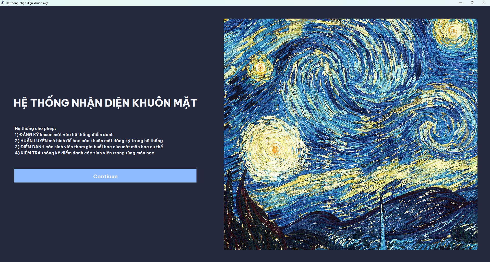
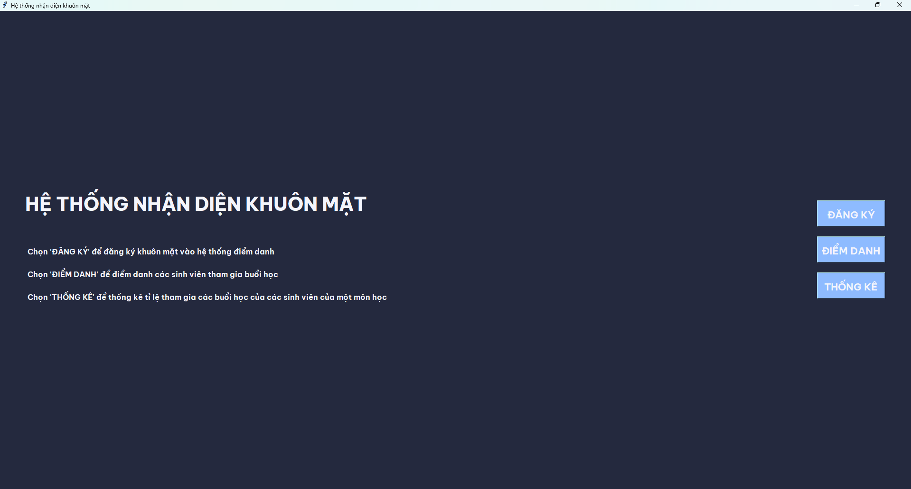
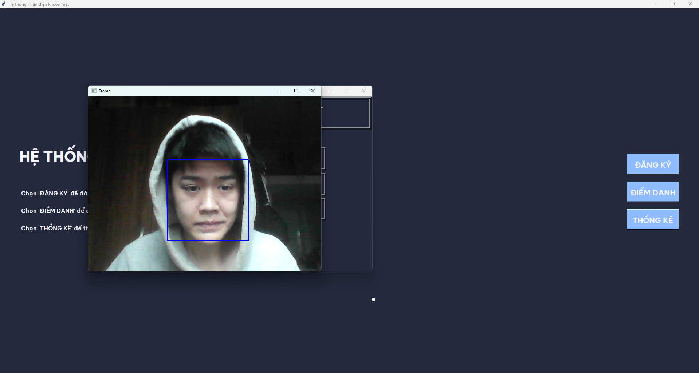
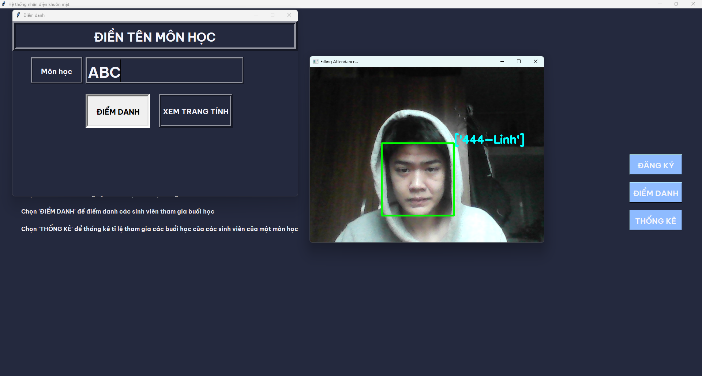
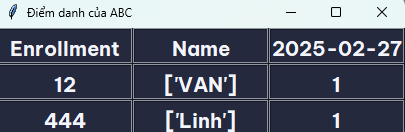

# Attendance Management System

                 

### Luồng dự án & giải thích
- Sau khi bạn chạy dự án, bạn phải đăng ký khuôn mặt của mình để hệ thống có thể nhận dạng bạn, nhấn vào đăng ký
- Sau khi bạn chọn, một cửa sổ nhỏ sẽ bật lên, trong đó bạn phải nhập MSV và tên của mình, sau đó nhấp vào nút `Chụp ảnh`
- Sau khi nhấp vào nút Chụp ảnh, một cửa sổ camera sẽ bật lên và nó sẽ phát hiện Khuôn mặt của bạn và chụp tối đa 50 Ảnh (bạn có thể thay đổi số lượng Ảnh mà nó có thể chụp) và lưu trữ trong thư mục có tên là TrainingImage. Bạn cung cấp càng nhiều ảnh cho hệ thống, nó sẽ hoạt động càng tốt trong khi nhận dạng khuôn mặt.
- Sau đó, bạn phải nhấp vào nút `Huấn luyện` Hình ảnh, nó sẽ huấn luyện mô hình và chuyển đổi tất cả Hình ảnh thành định dạng số để máy tính có thể hiểu. Lúc này mô hình đang huấn luyện hình ảnh để lần sau khi người đã đăng ký vào hệ thống sẽ dễ dàng được nhận dạng.
- Thời gian chạy sẽ mất một lượng thời gian khác nhau (tùy thuộc vào hệ thống của bạn).
- Sau khi huấn luyện mô hình, hãy nhấp vào `Tự động` tham dự, bạn phải nhập tên đối tượng và sau đó nó có thể điểm danh bằng khuôn mặt của bạn bằng mô hình đã được huấn luyện.
- Nó sẽ tạo tệp `.csv` cho mọi môn học bạn nhập và tách riêng từng tệp `.csv` theo môn học
- Bạn có thể xem điểm danh sau khi nhấp vào nút `Xem điểm danh`. Nó sẽ hiển thị hồ sơ theo định dạng bảng.

### Hình ảnh của hệ thống

#### Giao diện chính
 

 

#### Đăng ký khuôn mặt
 

#### Điểm danh
 

#### Sheet điểm danh sau kết thúc điểm danh

